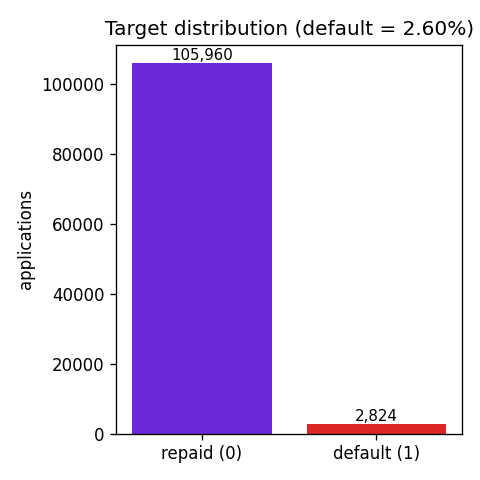
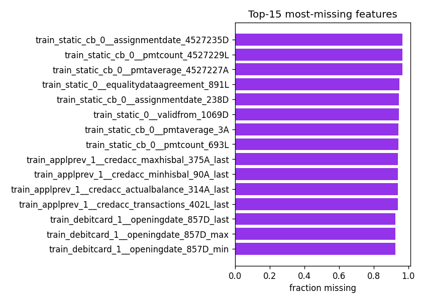
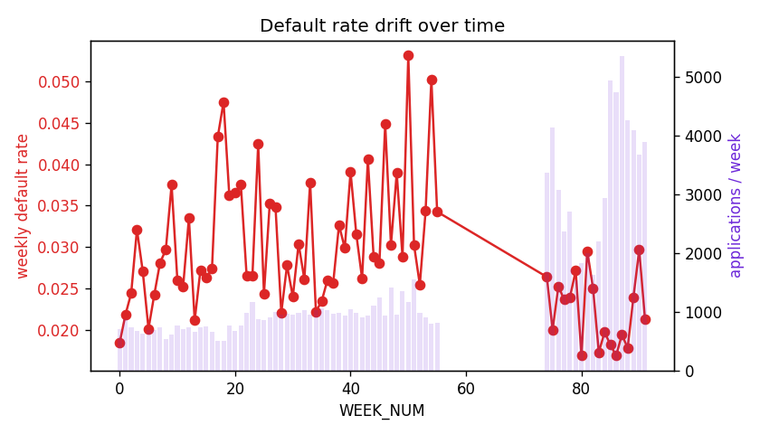

# Credit Scoring — Exploratory Data Analysis

## Dataset

- Engineered analysis frame: **108,784 applications** × **733 columns** (train sample 50,000 + held-out test 58,784).

- Numeric features: **649**, categorical: **81** (total modelled features 730).

## Target imbalance

- Default rate = **2.60%** (2,824 defaults / 108,784) — a **1 : 38** positive-to-negative ratio.

- This severe imbalance is why the project uses a **focal-loss objective** + cost-sensitive weighting rather than SMOTE, and scores on **Gini-stability** rather than raw accuracy.

## Missingness

- **178** of 730 features are >50% null — an artefact of the depth-0/1/2 relational tables, where most applicants have no bureau / previous-application history.

- Mean missingness across all features = **33.1%**.

- `features.py` drops all-null columns per source table before the join; LightGBM/CatBoost then consume the remaining NaNs natively.

## Temporal drift (why stability matters)

- Decisions span **WEEK_NUM 0–91** (74 weekly buckets).

- Weekly default rate ranges **1.69%–5.31%** (std 0.793%). A model whose discrimination decays as this base rate moves is penalised by the Gini-stability metric — the central modelling concern of this dataset.

- The train/test split is **forward-in-time** on WEEK_NUM (no future leakage), mirroring how a deployed scorecard actually ages.

