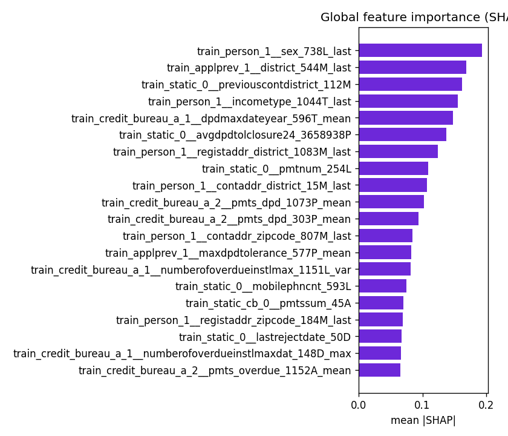
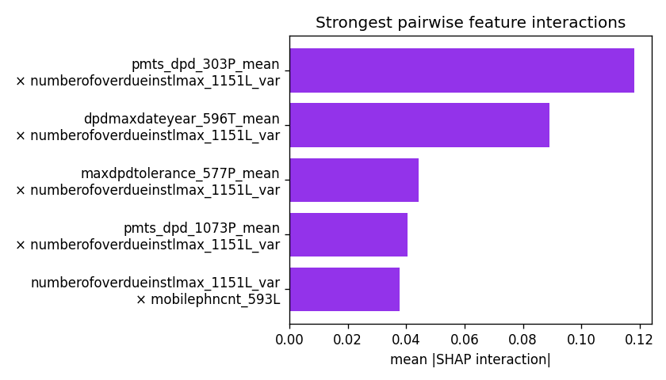
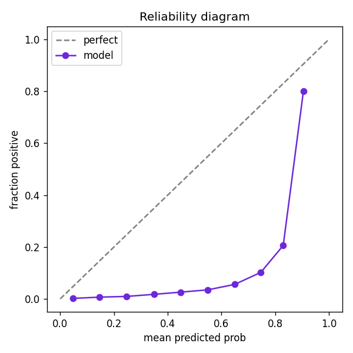

# Credit Scoring — Analysis Results

**Test Gini-stability** = 0.6417 (mean Gini 0.6643, slope 0.0021, res-std 0.0452)

## Business-cost threshold

- Optimal threshold = **0.813** (cost 1221) vs 0.5 (cost 2650) — **53.9%** cheaper.

## Explainability (SHAP)

Top features: train_person_1__sex_738L_last, train_applprev_1__district_544M_last, train_static_0__previouscontdistrict_112M, train_person_1__incometype_1044T_last, train_credit_bureau_a_1__dpdmaxdateyear_596T_mean, train_static_0__avgdpdtolclosure24_3658938P, train_person_1__registaddr_district_1083M_last, train_static_0__pmtnum_254L

## Feature interactions (SHAP interaction values)

Exact pairwise SHAP interaction values over the top-8 drivers. Strongest: pmts_dpd_303P_mean × numberofoverdueinstlmax_1151L_var; dpdmaxdateyear_596T_mean × numberofoverdueinstlmax_1151L_var; maxdpdtolerance_577P_mean × numberofoverdueinstlmax_1151L_var. Full ranking in `shap_interactions.csv`.

## Counterfactual recourse (DiCE)

Actionable recourse over the top-12 numeric drivers (surrogate model): the minimal feature changes that flip a rejected applicant to approved are saved to `reports/counterfactual_example.csv`. This is the GDPR Art. 22 'right to explanation' in practice.

## Fairness audit (gender)

- Demographic-parity difference = **0.0094**

- Equalized-odds difference = **0.0607**

- These two criteria cannot both be zero when base rates differ (Kleinberg et al., 2016) — the choice is a policy decision. See `fairness_by_group.csv`.

**Mitigation — Fairlearn `ThresholdOptimizer` (equalized-odds, per-group thresholds, no retraining):**

- Equalized-odds gap: **0.0607** -> **0.0000** after mitigation.

- Demographic-parity gap: 0.0094 -> 0.0000 (in-sample demonstration of the post-processing mechanism).

## Calibration

| method | brier | ece |
| --- | --- | --- |
| raw | 0.1262 | 0.2537 |
| platt | 0.0195 | 0.0016 |
| isotonic | 0.0193 | 0.0009 |

## Survival analysis (Cox PH, time-to-default)

- Harrell C-index = **0.6386** on 3 top SHAP features.

- Demonstrates lifetime-PD / IFRS-9 readiness beyond a binary classifier.
